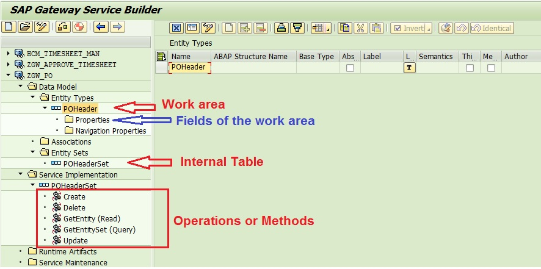

# Define Data Model

1. **T-CODE** `SEGW`
2. **Create Project**:
    1. `Project` = `ZGW_MYPROJECT_PO_USERNAME`
    2. `Description` = `Service for PO`
    3. Click `Local Object` => Project Create with 4 folders:
        1. `Data Model`:
            1. `Entity Types` => structure (work area = one row)
            2. `Entity Set` => internal table (more than one entity/rows)
        2. `Service Implementation`
        3. `Runtime Artifacts`
        4. `Service Maintenance`
    4. Create structure with its internal table:
        1. With fields One By One
            1. Right click on `Entity Types` -> `Create`
            2. Enter `Entity Type Name` = `POHeader` (Structure)
            3. Check on `Create Related Entity Set`
            4. `Entity Set Name` = `POHeaderSet` (Internal Table)
             <!-- Image located in the 'images' folder -->
            5. Operations or Methods => triggered by endpoints
            6. Define fields of the structure (work area) and internal table:
                1. Double click on `/Data Model/Entity Types/POHeader/Properties`
                2. Create field
                    1. Add field name
                    2. Add Type in `Edm Core Type`
                    3. Add Length in `Max`
                3. Complete others configurations if needed
        2. With fields using DDIC Structure
            1. Right click on `/Data Model` -> `Import` -> `DDIC Structure`
            2. `Name` = `POHeader` (Structure)
            3. Check on `Entity Type`
            4. `ABAP Structure` = `EKKO` (i.e.)
            5. Check on `Create Default Entity Set` (Create default relative internal table)
            6. Hit `Next`
            7. Select the desired fields
            8. Hit `Next`
            9. Select the `Is Key`
            10. Hit `Finish`

# Implement / Register the Service

1. Hit  (Generate Runtime Object) => Generation of the class for the:
    - MPC (Model Provider Class) => define the Gateway Service interface
    - DPC (Data Provider Class) => provides the Gateway Service functionalities
      => MPC & DPC are not connected by any coding => talk via Configuration
    - Service Registration => Technical Service which the external system needs to call
2. Provide Package and Transport
3. Save (i.e. local storage)

# Add Service to Service Catalog (Register the Service to Gateway Hub)

1. **Deployment**
    1. **Embedded Deployment**
        1. Click on `/Service Maintenance/{name of the service}`
        2. Select the system to activate
        3. Click on Register
        4. `System Alias` = `LOCAL` (i.e)
        5. `Creation Information -> Package Assignment` = `Local Object` (i.e)
        6. Hit  <!-- Image located in the 'images' folder -->
    2. **Non-Embedded Deployment**
        1. To complete
2. **Test the Service:**
    1. Click on `Maintain` (t-code: `/n/IWFND/MAINT_SERVICE`) and `Yes`
    2. Click on the service to test
    3. Click on `Call Browser` or `SAP Gateway Client` (t-code: `/n/IWFND/GW_CLIENT`)
        1. In `SAP Gateway Client` click on `HTTP` to see the URL
            1. => ==CASE SENSITIVE==
    4. Test `{URL}?$format=xml`
        [format=xml.md](format=xml) <!-- Note located in the root directory -->
    5. Test `{URL}?$format=json`
        [format=json.md](format=json) <!-- Note located in the root directory -->
    6. Test `{URL}$metadata`
        [metadata](metadata) <!-- Note located in the root directory -->
    7. To see errors use the service `/n/IWFND/ERROR_LOG`
3. **Pulling Data:**
    1. `{URL}POHeaderSet` (internal table)
        [Get before method implementation](Get_before_method_implementation) <!-- Note located in the root directory -->
    2. **Implement Method:**
        1. Go to `SEGW`
        2. Right click on `Service Implementation/{POHeaderSet}`
        3. Click on `Go to ABAP Workbench` &  <!-- Image located in the 'images' folder -->
        4. Right click on `{project_name_DPC_EXT}/Methods/Inherited Methods/{service}_GET_ENTITYSET` & `Redfine`
        5. Save & Activate (F3)
        6. Test again the query `{URL}POHeaderSet` (internal table)
            [Get after method implementation](Get_after_method_implementation) <!-- Note located in the root directory -->
        7. Enter a method to pull data
        8. Save & activate
        9. Test again the query `{URL}POHeaderSet` (internal table)
            [Get after method implementation and populate table](Get_after_method_implementation_and_populate_table) <!-- Note located in the root directory -->
        10. Understand OData URL
            [OData URL](OData_URL) <!-- Note located in the root directory -->
