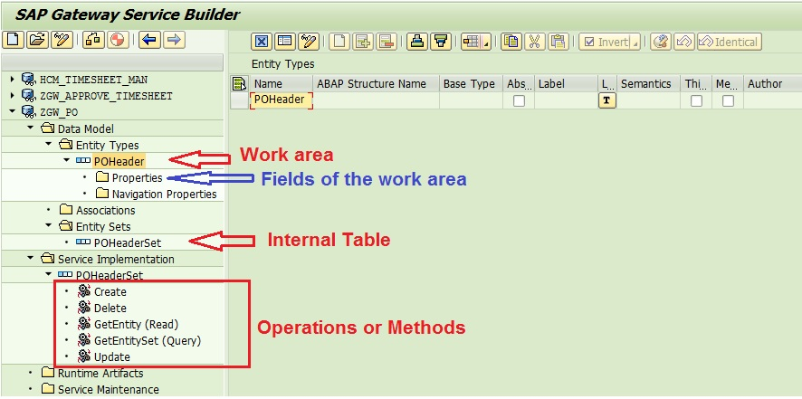

# Table of Contents

- [Table of Contents](#table-of-contents)
- [Define Data Model](#define-data-model)
- [Implement / Register the Service](#implement--register-the-service)
- [Add Service to Service Catalog](#add-service-to-service-catalog)
- [Pulling Data](#pulling-data)

---

# Define Data Model

1. **T-CODE**: `SEGW`
2. **Create Project**:
    1. **Project Name**: `ZGW_MYPROJECT_PO_USERNAME`
    2. **Description**: `Service for PO`
    3. **Steps**:
        1. Click `Local Object` to create a project with four folders:
            - **Data Model**:
                - `Entity Types` (structure with one row)
                - `Entity Set` (internal table with multiple rows)
            - **Service Implementation**
            - **Runtime Artifacts**
            - **Service Maintenance**
        2. Create a structure with its internal table:
            1. **Define Fields Individually**:
                - Right-click on `Entity Types` and select `Create`
                - **Entity Type Name**: `POHeader` (Structure)
                - Check `Create Related Entity Set`
                - **Entity Set Name**: `POHeaderSet` (Internal Table)
                - 
                - Define fields for the structure and internal table:
                    - Double-click `/Data Model/Entity Types/POHeader/Properties`
                    - Create a field by adding:
                        - Field Name
                        - Type in `Edm Core Type`
                        - Length in `Max`
                    - Complete other configurations if needed
            2. **Using DDIC Structure**:
                - Right-click `/Data Model` -> `Import` -> `DDIC Structure`
                - **Name**: `POHeader` (Structure)
                - Check `Entity Type`
                - **ABAP Structure**: `EKKO` (example)
                - Check `Create Default Entity Set`
                - Click `Next`, select desired fields, then `Next` again
                - Select `Is Key`
                - Click `Finish`

# Implement / Register the Service

1. **Generate Runtime Objects**:
    - Click  to generate the classes:
        - **MPC** (Model Provider Class) = Defines the Gateway Service interface
        - **DPC** (Data Provider Class) = Provides Gateway Service functionalities
        - **Service Registration** = Technical service for external systems
2. **Provide Package and Transport**
3. **Save** (e.g., local storage)

# Add Service to Service Catalog

1. **Deployment**:
    1. **Embedded Deployment**:
        - Navigate to `/Service Maintenance/{name of the service}`
        - Select the system to activate
        - Click `Register`
        - **System Alias**: `LOCAL` (example)
        - **Creation Information -> Package Assignment**: `Local Object` (example)
        - Click 
    2. **Non-Embedded Deployment**:
        - To be completed
2. **Test the Service**:
    1. Click `Maintain` (t-code: `/n/IWFND/MAINT_SERVICE`) and select `Yes`
    2. Choose the service to test
    3. Use `Call Browser` or `SAP Gateway Client` (t-code: `/n/IWFND/GW_CLIENT`)
        - In `SAP Gateway Client`, click `HTTP` to view the URL
            - Note: **CASE SENSITIVE**
    4. **Test URLs**:
        - `{baseurl}?$format=xml`: [format=xml](format=xml.md)
        - `{baseurl}?$format=json`: [format=json](format=json.md)
        - `{baseurl}$metadata`: [metadata](metadata.md)
    5. **View Errors**: Use the service `/n/IWFND/ERROR_LOG`

# Pulling Data

1. **Initial Check**:
    - `{baseurl}POHeaderSet` (internal table)
        - [Get before method implementation](Get_before_method_implementation.md)
2. **Implement Method**:
    - Navigate to `SEGW`
    - Right-click `Service Implementation/{POHeaderSet}`
    - Click `Go to ABAP Workbench` and 
    - Right-click `{project_name_DPC_EXT}/Methods/Inherited Methods/{service}_GET_ENTITYSET` and select `Redefine`
    - Save & Activate (F3)
    - **Test the Query Again**:
        - `{baseurl}POHeaderSet` (internal table)
            - [Get after method implementation](Get_after_method_implementation.md)
    - **Data Method Implementation**:
        - Add a method to pull data
        - Save & Activate
        - Test the query `{baseurl}POHeaderSet` again
            - [Get after method implementation and populate table](Get_after_method_implementation_and_populate_table.md)
    - **Understand OData URL**:
        - [OData URL](OData_URL.md)
